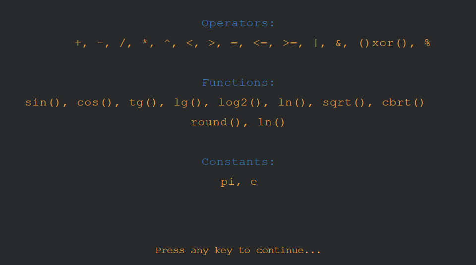

# EvalMat

> An evaluator of mathematical expressions written in C/C++ with UI for my faculty project.

## Functions

Functions suported:

`sin()`: Returns the sine of an angle of x radians.
`cos()`: Returns the cosine of an angle of x radians.
`tg()`: Returns the tangent of an angle of x radians.
`lg()`: Returns the common (base-10) logarithm of x.
`log2()`: Returns the binary (base-2) logarithm of x.
`ln()`: Returns the natural logarithm of x.
`sqrt()`: Returns the square root of x.
`cbrt()`: Returns the cubic root of x.
`round()`: Returns the integral value that is nearest to x, with halfway cases rounded away from zero.
`ln()`: Returns the natural logarithm of x.

## About

The application was made using only the [Graphics.h library](https://github.com/SagarGaniga/Graphics-Library). It was painful but was part of my assignment. Enjoy :)
